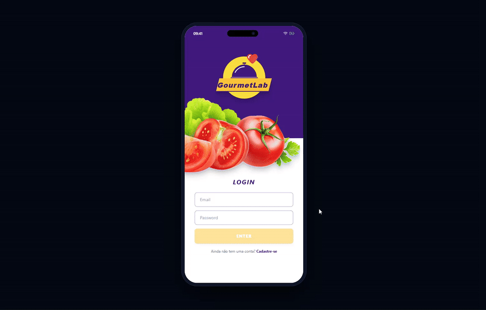
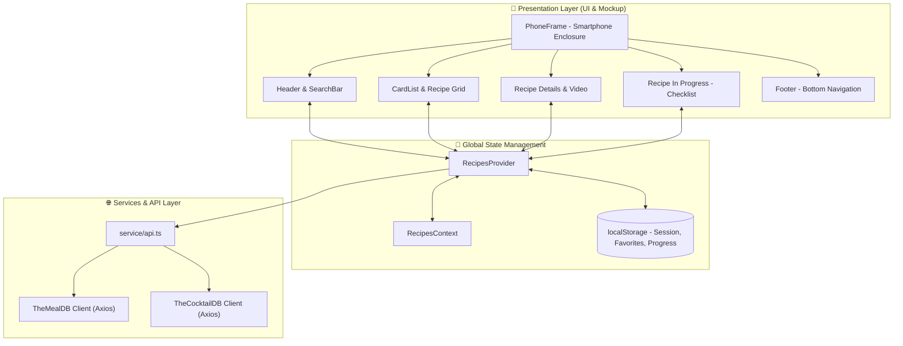

# 🍳 GourmetLab — Recipes & Drinks Mobile Web App

[](https://react.dev/)
[](https://www.typescriptlang.org/)
[](https://vitejs.dev/)
[](https://tailwindcss.com/)
[](https://vitest.dev/)
[](https://axios-http.com/)
[](https://opensource.org/licenses/MIT)

> 🇧🇷 [**Versão em Português**](README.md) | 🇺🇸 **English**

**GourmetLab** is a cutting-edge mobile-first web application designed for global culinary and cocktail exploration. Built with scalable component architecture, asynchronous consumption of the public **TheMealDB** and **TheCocktailDB** APIs, reactive centralized state management via React Context API, and a visual experience simulating a real smartphone with status bar, dynamic island, and ergonomic navigation.

## 📌 Quick Navigation

- [📝 About the Project](#-about-the-project)
- [🖼️ Preview](#️-preview)
- [🌐 Live Deployment](#-live-deployment)
- [⚡ API Endpoints](#-api-endpoints)
- [✨ Features](#-features)
- [🛠️ Technologies and Tools](#️-technologies-and-tools)
- [🏛️ Solution Architecture](#️-solution-architecture)
- [📁 Repository Structure](#-repository-structure)
- [💡 Technical Decisions](#-technical-decisions)
- [🚀 Getting Started](#-getting-started)
- [📄 License](#-license)

## 📝 About the Project

**GourmetLab** was crafted to turn the cooking and mixology experience into an intuitive, elegant, and practical journey. With an uncompromising mobile-first design philosophy, the app presents a device-enclosed smartphone container featuring a distinctive `#41197F` primary purple identity and `#FCC436` golden accents.

The platform provides complete culinary lifecycle support: ingredient and title searches, quick category filtering, interactive step-by-step progress checklists stored locally, persistent favorites collection, and one-click clipboard link sharing.

## 🖼️ Preview



## 🌐 Live Deployment

Access the production application:
👉 **[GourmetLab](https://gourmetlab-gamma.vercel.app/)**

## ⚡ API Endpoints

The application consumes two reliable, public culinary databases via customized **Axios** HTTP client instances:

### 🍽️ TheMealDB API (`https://www.themealdb.com/api/json/v1/1`)
- `GET /search.php?s={name}` — Search meals by name and initial listing.
- `GET /filter.php?i={ingredient}` — Filter meals by main ingredient.
- `GET /search.php?f={letter}` — Browse meals by first letter.
- `GET /filter.php?c={category}` — Categorized meal filtering (Beef, Breakfast, Chicken, Dessert, Goat).
- `GET /lookup.php?i={id}` — Complete recipe details (ingredients, quantities, instructions, YouTube video).
- `GET /list.php?c=list` — Category list for quick pill filter buttons.

### 🍸 TheCocktailDB API (`https://www.thecocktaildb.com/api/json/v1/1`)
- `GET /search.php?s={name}` / `GET /search.php?f=a` — Search cocktails with resilient fallback loading.
- `GET /filter.php?i={ingredient}` — Filter cocktails by ingredient.
- `GET /search.php?f={letter}` — Browse drinks by starting character.
- `GET /filter.php?c={category}` — Categories (Ordinary Drink, Cocktail, Shake, Other/Unknown, Cocoa).
- `GET /lookup.php?i={id}` — Full cocktail preparation guide and glass recommendations.
- `GET /list.php?c=list` — Drink categories list for horizontal filter buttons.

## ✨ Features

- 📱 **Realistic Smartphone Mockup Frame:** Clean mobile frame with dynamic pill camera (Dynamic Island), system status bar, and bottom home indicator bar.
- 🔐 **Authentication & Live Form Validation:** Email format and password length validation with real-time feedback and session persistence in `localStorage`.
- 🔍 **Multi-criteria Live Search:** Search by ingredient, meal name, or first letter, featuring automatic redirection when exactly one result is found.
- 🏷️ **Quick Horizontal Category Filtering:** 5-category scrollable pills with toggle activation and an "All" reset option.
- 📖 **Immersive Recipe Details:** Banner hero header, unified ingredient measurements, preparation instructions, embedded YouTube player, and cross-recommendation carousel (meals recommend drinks and vice versa).
- ⏱️ **Interactive Recipe in Progress:** Ingredient checklist with interactive strikethroughs, persistent progress state, and finish button enabled only when 100% complete.
- ❤️ **Favorites & Link Sharing:** Persistent favorite toggling and instant link copying with floating toast notification.
- 📜 **Done Recipes & Favorites Collections:** Filterable tabs (All, Food, Drinks) to browse and manage completed or saved recipes.
- 👤 **User Profile Hub:** User information, quick action navigation links, and seamless Logout.

## 🛠️ Technologies and Tools

| Layer / Purpose | Technology | Description |
| :--- | :--- | :--- |
| **Primary Language** | **TypeScript 5.7** | Strict static typing for API payloads, state contracts, and component props |
| **UI Library** | **React 18.3** | Modular component development using React Hooks (`useState`, `useEffect`, `useContext`) |
| **Routing** | **React Router DOM 5.3** | Declarative SPA route management and browser navigation history |
| **State Management** | **React Context API** | Centralized global store avoiding heavy third-party dependencies |
| **HTTP Client** | **Axios 1.7** | Dedicated client instances with payload normalization and fallbacks |
| **Styling** | **Tailwind CSS 3.4** | Utility-first design system centered around brand color `#41197F` |
| **Vector Icons** | **React Icons 5.4** | Lightweight icon library (Feather Icons and FontAwesome) |
| **Build & Dev Tool** | **Vite 6.0** | Ultra-fast Hot Module Replacement and production bundling |
| **Automated Testing** | **Vitest 2.1 & Testing Library** | Unit, integration, and routing test suites |
| **Code Quality** | **ESLint 8.57 & TypeScript ESLint** | Zero-warning linting configuration and consistent code style |

## 🏛️ Solution Architecture



## 📁 Repository Structure

```text
project-recipes-app/
├── docs/
│   └── images/              # Media assets and README preview files
├── public/                  # Favicon and static public assets
├── src/
│   ├── components/          # Modular UI components
│   │   ├── AppLogo.tsx      # GourmetLab brand logo
│   │   ├── CardList.tsx     # Recipe cards grid with tags and prep time
│   │   ├── CarouselDrinks.tsx
│   │   ├── CarouselMeals.tsx
│   │   ├── FilterButton.tsx # Horizontal category filter pills
│   │   ├── Footer.tsx       # Bottom docked navigation bar
│   │   ├── Header.tsx       # Adaptive top bar with search and profile
│   │   ├── LoadingScreen.tsx
│   │   ├── Login.tsx        # Branded login screen
│   │   ├── PhoneFrame.tsx   # Realistic smartphone enclosure with status bar
│   │   └── SearchBar.tsx    # Search input with radio filter selectors
│   ├── context/             # Global state management via Context API
│   │   ├── RecipesContext.ts
│   │   └── RecipesProvider.tsx
│   ├── images/              # Vector icons and project imagery
│   ├── pages/               # Routed view pages
│   │   ├── DoneRecipes.tsx
│   │   ├── DrinkRecipeInProgress.tsx
│   │   ├── Drinks.tsx
│   │   ├── FavoritedRecipes.tsx
│   │   ├── MealRecipeInProgress.tsx
│   │   ├── Meals.tsx
│   │   ├── Profile.tsx
│   │   ├── RecipeDrinksDetails.tsx
│   │   └── RecipeMealsDetails.tsx
│   ├── service/             # TheMealDB and TheCocktailDB API integration
│   │   └── api.ts
│   ├── tests/               # Automated test suites with Vitest
│   ├── types/               # TypeScript interfaces and data definitions
│   ├── App.tsx              # Root component and router switch
│   ├── index.css            # Tailwind directives and base styles
│   └── index.tsx            # React DOM mounting entrypoint
├── tailwind.config.js       # Design System and color palette setup
├── tsconfig.json            # Strict TypeScript configuration
└── vite.config.ts           # Vite build pipeline and plugin setup
```

## 💡 Technical Decisions

- **Design System Centered on `#41197F`:** The visual identity was completely unified around `#41197F` as the primary brand purple, complemented by golden `#FCC436` accents for calls-to-action, establishing high-end aesthetic contrast.
- **Mobile Smartphone Isolation:** The application is framed within `PhoneFrame`, ensuring that even on ultra-wide desktop monitors, the user experiences proportions and ergonomics identical to a flagship modern smartphone.
- **API Consumption Resilience:** TheCocktailDB API returns anomalous payloads in certain query scenarios (e.g. string `"no data found"` instead of an empty array). Strict `Array.isArray` guards and transparent alphabetical fallbacks were engineered to prevent runtime breakage.
- **TypeScript Strict Mode:** Full end-to-end static typing eliminating `any`, empowering precision autocomplete, long-term maintainability, and compile-time safety.
- **Modern Testing with Vitest and Testing Library:** Migrated legacy test setups to Vitest natively integrated with Vite, delivering fast test execution with coverage of critical navigation and user flows.

## 🚀 Getting Started

### Prerequisites
- **Node.js** version `18.x` or higher
- **npm** or **yarn** package manager

### Local Setup and Execution

1. Clone the repository:
   ```bash
   git clone https://github.com/ludson96/project-recipes-app.git
   ```

2. Navigate to the project directory:
   ```bash
   cd project-recipes-app
   ```

3. Install project dependencies:
   ```bash
   npm install
   ```

4. Start the development server:
   ```bash
   npm run dev
   ```
   The application will be accessible at `http://localhost:5173/` (or the port specified in terminal output).

5. Run automated tests:
   ```bash
   npm test
   ```

6. Run the linter check:
   ```bash
   npm run lint
   ```

## 📄 Licença

<div align="center">
  Desenvolvido por <strong>Ludson Pereira dos Santos</strong> 🚀<br />
  <a href="https://www.linkedin.com/in/ludson96/">LinkedIn</a> • <a href="https://github.com/ludson96">GitHub</a> • <a href="mailto:ludson_ps27@hotmail.com">E-mail</a>
</div>
