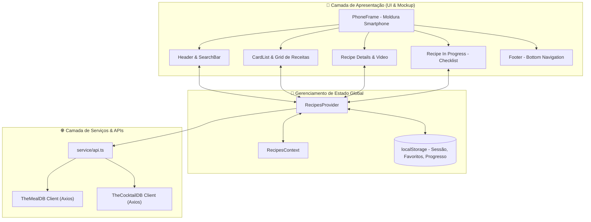

# 🍳 GourmetLab — Recipes & Drinks Mobile Web App

[](https://react.dev/)
[](https://www.typescriptlang.org/)
[](https://vitejs.dev/)
[](https://tailwindcss.com/)
[](https://vitest.dev/)
[](https://axios-http.com/)
[](https://opensource.org/licenses/MIT)

> 🇧🇷 **Português** | 🇺🇸 [**English Version**](README.en.md)

O **GourmetLab** é uma aplicação web mobile-first de ponta voltada à exploração gastronômica e coquetelaria mundial. Construído com arquitetura de componentes escalável, consumo assíncrono das APIs abertas **TheMealDB** e **TheCocktailDB**, estado centralizado reativo com React Context API e uma experiência visual que simula um dispositivo smartphone real com status bar, dynamic island e navegação ergonômica.

📌 Navegação Rápida

- [📝 Sobre o Projeto](#-sobre-o-projeto)
- [🖼️ Preview](#️-preview)
- [🌐 Deploy da Aplicação](#-deploy-da-aplicação)
- [⚡ API Endpoints](#-api-endpoints)
- [✨ Funcionalidades](#-funcionalidades)
- [🛠️ Tecnologias e Ferramentas Utilizadas](#️-tecnologias-e-ferramentas-utilizadas)
- [🏛️ Arquitetura da Solução](#️-arquitetura-da-solução)
- [📁 Estrutura do Repositório](#-estrutura-do-repositório)
- [💡 Decisões Técnicas](#-decisões-técnicas)
- [🚀 Como Executar o Projeto](#-como-executar-o-projeto)
- [📄 Licença](#-licença)

📝 Sobre o Projeto

O **GourmetLab** foi desenvolvido para transformar a experiência de cozinhar e preparar drinks em uma jornada intuitiva, elegante e prática. A aplicação opera com foco absoluto em usabilidade mobile, apresentando layout contido em moldura de smartphone de alta definição com design system fundamentado na cor primária `#41197F` e detalhes em dourado `#FCC436`.

O projeto oferece suporte completo ao ciclo culinário: descoberta por ingredientes ou nomes, filtragem rápida por categorias clássicas, acompanhamento do preparo com checklist interativo passo a passo salvo no navegador, sistema de favoritos persistente e compartilhamento instantâneo via área de transferência.

🖼️ Preview

  

🌐 Deploy da Aplicação

Acesse a aplicação em produção:
👉 **[GourmetLab na Vercel](https://gourmetlab-gamma.vercel.app/)**

⚡ API Endpoints

A aplicação consome duas bases de dados gastronômicas abertas de alta disponibilidade via instâncias especializadas do **Axios**:

### 🍽️ TheMealDB API (`https://www.themealdb.com/api/json/v1/1`)
- `GET /search.php?s={name}` — Pesquisa de pratos por nome e listagem inicial de receitas.
- `GET /filter.php?i={ingredient}` — Filtro de receitas pelo ingrediente principal.
- `GET /search.php?f={letter}` — Busca de refeições pela primeira letra.
- `GET /filter.php?c={category}` — Filtragem por categorias (Beef, Breakfast, Chicken, Dessert, Goat).
- `GET /lookup.php?i={id}` — Detalhes completos da receita (ingredientes, medidas, instruções e vídeo YouTube).
- `GET /list.php?c=list` — Lista de categorias para os botões de filtro rápido.

### 🍸 TheCocktailDB API (`https://www.thecocktaildb.com/api/json/v1/1`)
- `GET /search.php?s={name}` / `GET /search.php?f=a` — Pesquisa de drinks por nome e carregamento inicial resiliente.
- `GET /filter.php?i={ingredient}` — Filtragem de coquetéis por ingrediente.
- `GET /search.php?f={letter}` — Busca de drinks pela primeira letra.
- `GET /filter.php?c={category}` — Categorias (Ordinary Drink, Cocktail, Shake, Other/Unknown, Cocoa).
- `GET /lookup.php?i={id}` — Detalhes do coquetel com modo de preparo e copos recomendados.
- `GET /list.php?c=list` — Relação de categorias para botões de filtro.

✨ Funcionalidades

- 📱 **Simulação de Smartphone Realista:** Moldura com câmera dinâmica em pílula (Dynamic Island), barra de status do sistema e indicador de navegação inferior.
- 🔐 **Autenticação Simples & Validação em Tempo Real:** Validação de e-mail e senha mínima com feedback visual e persistência dos dados de sessão no `localStorage`.
- 🔍 **Barra de Busca Dinâmica e Multi-critério:** Filtro por ingrediente principal, nome exato ou primeira letra, com redirecionamento automático caso seja encontrado um único resultado.
- 🏷️ **Filtros Rápidos por Categoria:** Seleção em carrossel horizontal de 5 categorias com botão de reset ("Todas") e alternância por toggle.
- 📖 **Página de Detalhes Completa:** Banner imersivo, proporções de ingredientes unificadas, instruções detalhadas, player de vídeo do YouTube e carrossel de recomendações cruzadas (refeições recomendam bebidas e vice-versa).
- ⏱️ **Modo Receita em Progresso:** Checklist interativo que risca ingredientes já utilizados, persiste o avanço em tempo real e habilita a finalização da receita apenas após 100% de conclusão.
- ❤️ **Sistema de Favoritos & Compartilhamento:** Botão de favoritar interativo e cópia de link para a área de transferência com aviso de feedback flutuante (toast).
- 📜 **Histórico de Receitas Feitas e Favoritas:** Abas com filtros por tipo (Todas, Comidas, Bebidas) para gerenciar facilmente o acervo pessoal.
- 👤 **Área de Perfil:** Informações do usuário logado, atalhos rápidos e ação de encerramento de sessão (Logout).

🛠️ Tecnologias e Ferramentas Utilizadas

| Camada / Finalidade | Tecnologia | Descrição |
| :--- | :--- | :--- |
| **Linguagem Principal** | **TypeScript 5.7** | Tipagem estática rigorosa para contratos de API, estados e props |
| **Biblioteca de UI** | **React 18.3** | Componentização modular com React Hooks (`useState`, `useEffect`, `useContext`) |
| **Roteamento** | **React Router DOM 5.3** | Gerenciamento de rotas e histórico de navegação SPA |
| **Gerenciamento de Estado** | **React Context API** | Estado global centralizado sem dependências externas pesadas |
| **Cliente HTTP** | **Axios 1.7** | Instâncias dedicadas com tratamento de payloads e fallbacks |
| **Estilização** | **Tailwind CSS 3.4** | Design system utilitário centrado na cor primária `#41197F` |
| **Ícones Vetoriais** | **React Icons 5.4** | Biblioteca de ícones (Feather Icons e FontAwesome) |
| **Build & Dev Server** | **Vite 6.0** | HMR ultra-rápido e empacotamento otimizado para produção |
| **Testes Automatizados** | **Vitest 2.1 & Testing Library** | Bateria de testes de componentes, rotas e integração |
| **Padronização de Código** | **ESLint 8.57 & TypeScript ESLint** | Regras de qualidade de código sem warnings e tipagem limpa |

🏛️ Arquitetura da Solução



📁 Estrutura do Repositório

```text
project-recipes-app/
├── docs/
│   └── images/              # Ativos de mídia e preview do README
├── public/                  # Favicon e ativos estáticos públicos
├── src/
│   ├── components/          # Componentes reutilizáveis da interface
│   │   ├── AppLogo.tsx      # Identidade visual da marca GourmetLab
│   │   ├── CardList.tsx     # Grid de cards com badges e tempo estimado
│   │   ├── CarouselDrinks.tsx
│   │   ├── CarouselMeals.tsx
│   │   ├── FilterButton.tsx # Carrossel de botões de categoria
│   │   ├── Footer.tsx       # Barra de navegação inferior docada
│   │   ├── Header.tsx       # Cabeçalho adaptativo com busca e perfil
│   │   ├── LoadingScreen.tsx
│   │   ├── Login.tsx        # Tela de acesso com visual oficial
│   │   ├── PhoneFrame.tsx   # Mockup de smartphone realista com status bar
│   │   └── SearchBar.tsx    # Formulário de busca e filtros de rádio
│   ├── context/             # Gerenciamento de estado global via Context API
│   │   ├── RecipesContext.ts
│   │   └── RecipesProvider.tsx
│   ├── images/              # Ícones vetoriais e imagens do projeto
│   ├── pages/               # Telas mapeadas no React Router
│   │   ├── DoneRecipes.tsx
│   │   ├── DrinkRecipeInProgress.tsx
│   │   ├── Drinks.tsx
│   │   ├── FavoritedRecipes.tsx
│   │   ├── MealRecipeInProgress.tsx
│   │   ├── Meals.tsx
│   │   ├── Profile.tsx
│   │   ├── RecipeDrinksDetails.tsx
│   │   └── RecipeMealsDetails.tsx
│   ├── service/             # Integrações com TheMealDB e TheCocktailDB
│   │   └── api.ts
│   ├── tests/               # Bateria de testes automatizados com Vitest
│   ├── types/               # Tipagens e interfaces TypeScript
│   ├── App.tsx              # Componente raiz e rotas
│   ├── index.css            # Diretivas do Tailwind e estilos base
│   └── index.tsx            # Ponto de entrada React DOM
├── tailwind.config.js       # Configuração do Design System e cores
├── tsconfig.json            # Configurações do TypeScript Strict
└── vite.config.ts           # Configuração de build e plugins do Vite
```

💡 Decisões Técnicas

- **Design System Centrado em `#41197F`:** A identidade visual foi totalmente consolidada em torno do roxo primário `#41197F`, acompanhado por tons dourados `#FCC436` para ações e destaques, gerando contraste premium e refinado.
- **Isolamento em Moldura Mobile:** A experiência foi configurada através do `PhoneFrame`, garantindo que mesmo ao ser visualizada em telas desktop ultra-wide, a aplicação preserve proporções idênticas às de um aparelho móvel topo de linha.
- **Resiliência no Consumo de APIs:** A API do TheCocktailDB retorna respostas inconsistentes em cenários de pesquisa aberta (como strings `"no data found"` em vez de arrays vazios). Implementou-se validação estrita com `Array.isArray` e mecanismos de fallback alfabético transparente para evitar interrupções de execução.
- **TypeScript Strict:** Tipagem estática integral eliminando o uso de `any`, garantindo auto-complete preciso, manutenibilidade a longo prazo e segurança em tempo de compilação.
- **Testes com Vitest e Testing Library:** Substituição do runner legado pelo Vitest integrado ao ecossistema Vite, alcançando execução ágil de testes unitários e de integração com cobertura das rotas críticas.

🚀 Como Executar o Projeto

### Pré-requisitos
- **Node.js** na versão `18.x` ou superior
- Gerenciador de pacotes **npm** ou **yarn**

### Instalação e Execução Local

1. Clone o repositório:
   ```bash
   git clone https://github.com/ludson96/project-recipes-app.git
   ```

2. Acesse o diretório do projeto:
   ```bash
   cd project-recipes-app
   ```

3. Instale as dependências:
   ```bash
   npm install
   ```

4. Inicie o servidor de desenvolvimento:
   ```bash
   npm run dev
   ```
   A aplicação estará acessível em `http://localhost:5173/` (ou na porta indicada pelo terminal).

5. Executar os testes automatizados:
   ```bash
   npm test
   ```

6. Executar a verificação de lint:
   ```bash
   npm run lint
   ```

📄 Licença

Este projeto está sob a licença **MIT**. Consulte o arquivo `LICENSE` para obter mais detalhes.

<div align="center">
  Desenvolvido por <strong>Ludson Pereira dos Santos</strong> 🚀<br />
  <a href="https://www.linkedin.com/in/ludson96/">LinkedIn</a> • <a href="https://github.com/ludson96">GitHub</a> • <a href="mailto:ludson_ps27@hotmail.com">E-mail</a>
</div>
